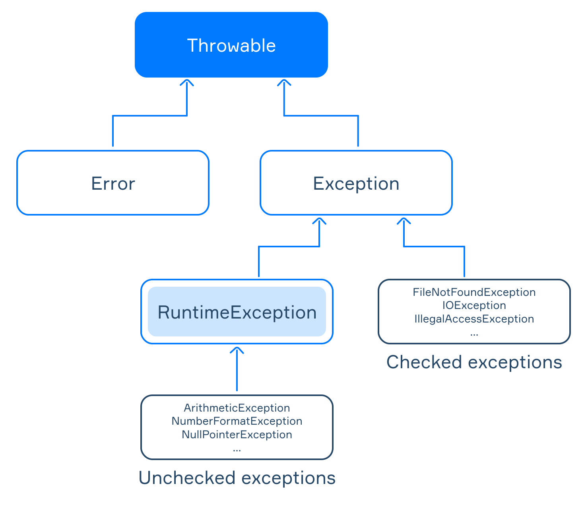

# Jerarquia de Excepciones
Java es principalmente un lenguaje orientado a objetos. En tala paradigma, todas las excepciones se consideran objetos de clases especiales organizadas en una jerarquia de clase.  
La siguiente imagen ilustra la jerarquia simplificada de excepciones:

La clase base para todas las excepciones es `java.lang.Throwable`. Esta clase proporciona un conjunto de metodos comunes para todas la excepciones:
- `String getMessage()` devuelve el mensaje de cadena detallado de este tipo de excepcion.
- `Throwable getCause()` devuelve la causa de esta excepcion o `null` si la causa es inexistente o desconocida.
- `printStackTrace()` imprime le seguimiento de la pila en el flojo de error estandar.  
La clase `Throwable` tiene dos subclases directas `java.lang.Error` y ``java.lang.Exception`.
- Las subclases de `Error` representan excepciones de bajo nivel en la JVM, por ejemplo: `OutOfMemoryError`, `StackOverFlowError`.
- Las subclases de `Exception` tratan con eventos excepcionales dentro de las aplicaciones, tales como: `RuntimeException`, `IOException`.
- La clase `RuntimeException` es una subclase bastante especial de `Exception`. Representa las llamadas: excepciones no verificadas, que incluyen `ArithmeticException`, `NumberFormatException`, `NullPointerException`.
---
## Excepciones marcadas y no marcadas
Las **excepciones marcadas** estan representadas por la clase `Exception`, excluyendo `RuntimeException`. El compilador verifica si el programa espera que ocurran tales excepciones en un programa o no. Si un metodo arroja una excepcion verificada, esto debe marcarse en la declaracion usando la palabra `throws`, de lo contrario el programa no compilara.
~~~java
public static String readLineFromFile() throws FileNotFoundException {
    Scanner scanner = new Scanner(new File("file.txt")); // java.io.FileNotFoundException
    return scanner.nextLine();
}
~~~
Aqui `FileNotFoundException` es una excepcion comprobada estandar. Este constructor de `Scanner` declara un `FileNotFoundException`, porque asumimos que el archivo especificado puede no existir. Lo mas importante es que hay una sola linea en el metodo que puede generar una excepcion, por lo que colocamos la palabra `throws` en la declaracion del metodo.  
Las **excepciones no marcadas** estan representadas por el `RuntimeException` y todas sus subclases. El compiladores no verifica si el programa espera que ocurran tales excepciones en un programa.  
Aqui hay un metodo que arroja `NumberFormatException` cuando la cadena de entrada tiene un formato valido (p. ej. `"abc"`).
~~~java
public static Long convertStringToLong(String str) {
    return Long.parseLong(str); // Podria arrojar un NumberFormatException
}
~~~

Este codigo se compilara con exito sin la palabra `throws` en la declaracion.  
Las excepciones de tiempo de ejecucion pueden ocurrir en cualquier parte de un programa. El compilador no requiere que especifique excepciones de tiempo de ejecucion en las declaraciones. La clase `Error` y sus subclases tambien se consideran excepciones no verificadas. Sin embargo, forman una clase separada.

---
## Ejercicios
1. Crear una clase llamada `MyException` que debe heredar de la clase base para todas las excepciones y errores. El constructor debe recibir una mensaje y pasarlo al constructor de la superclase.
~~~java
class MyException extends Throwable {

    public MyException(String message) {
        super(message);
    }
}

//do not change the code
class Main {
    public static void main(String[] args) {
        MyException myException = new MyException("This is a custom exception");
        System.out.println(myException.getMessage());
        Class<?> superClass = myException.getClass().getSuperclass();
        System.out.println(superClass.equals(Throwable.class));
    }
}
~~~
2. Escriba el nombre completo de la clase base para todas las excepciones no marcadas.
~~~java
java.lang.RuntimeException
~~~
3. Agrupa las excepciones entre marcadas y no marcadas.
~~~java
// Checked
Exception
IOException
ClassNotFoundException
// Uncheked
NullPointerException
RuntimeException
IndexOutOfBoundsException
ClassCastException
~~~
4. Escriba el nombre completo de la clase base para todos los errores y excepciones.
~~~java
java.lang.Throwable
~~~
5. Crea una clase llamada `UncheckedException`, que debe heredar de una excepcion no marcada. Dentro de `UncheckedException` declara un constructor sin argumentos.
~~~java
class UncheckedException extends RuntimeException {
    public UncheckedException() {}
}

class Main {
    public static void main(String[] args) {
        UncheckedException uncheckedException = new UncheckedException();
        System.out.println(uncheckedException instanceof RuntimeException);
    }
}
~~~
6. Crea una clase llamada `BadRequestException` con el constructor que toma un mensaje como argumento y lo pasa a la superclase. `BadRequestException` de heredar de una excepcion marcada.
~~~java
class BadRequestException extends Exception {
    public BadRequestException(String message) {
        super(message);
    }
}
~~~
