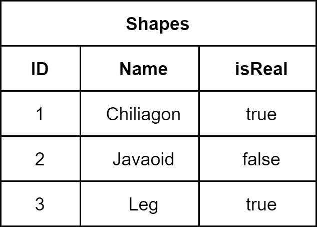

# Declaraciones JDBC
Hemos establecido una conexion con una base de datos en el tema anterior y ahora estamos listos para agregar registros a las tablas de la base de datos y recuperar resultados de ellas. Para realizar acciones en una base de datos, necesitamos usar sentencias SQL. Una interfaz `java.sql.Statement` representa dichas declaraciones en la API de JDBC.  
Primero, necesitamos establecer una conexion con la base de datos para poder ejecutar declaraciones desde nuestra aplicacion. Entonces debe crear un objeto `Statement` usando un objeto `Connection`. Mas precisamente, tenemos que llamar al metodo `createStatement()` de `Connection` que crea un `Statement`.  
Una vez que se crea el objeto `Statement`, podemos ejecutar sentencias SQL llamando a sus metodos de ejecucion. El metodo mas generico es `execute(String sql)`. Ejecuta una sentencia SQL dada y devuelve `true` si hay datos de retorno, de lo contrario `false`. Por ejemplo, para la sentencia `SELECT` retorna `true` y para `INSERT` retorna `FALSE`.  
Sin embargo, la interface `Statement` tiene otros metodos de ejecucion mas especificos. Uno de ellos es `executeUpdate(String sql)`. A diferencias de `execute()`, el metodo `executeUpdate()` retorna el numero de filas afectadas por la instruccion SQL.  
Use `executeUpdate` para instrucciones **INSERT**, **DELETE** y **UPDATE** o para instrucciones que no devuelven nada, como **CREATE** o **DROP**.  
Vamos a crear una una base de datos SQLite `westeros.db` y luego crear una tabla de las grandes casas de los siete reinos usando el metodo `executeUpdate`.
~~~java
public class Westeros {
    public static void main(String[] args) {
        String url = "jdbc:sqlite:C:/sqlite/westeros.db";

        SQLiteDataSource dataSource = new SQLiteDataSource();
        dataSource.setUrl(url);

        try (Connection con = dataSource.getConnection()) {
            // Creacion de Statement
            try (Statement statement = con.createStatement()) {
                // ejecucion de Statement
                statement.executeUpdate("CREATE TABLE IF NOT EXISTS(" +
                "id INTEGER PRIMARY KEY," +
                "name TEXT NOT NULL," +
                "words TEXT NOT NULL)");
            } catch (SQLException e) {
                e.printStackTrace();
            }
        } catch (SQLException e) {
            e.printStackTrace();
        }
    }
}
~~~
Una vez que ejecutemos el programa anterior, crearemos una tabla `HOUSES` que almacena un `id` de la casa, su `name` y `words`. Ahora, agreguemos varias casas a la tabla. Para eso, usaremos `executeUpdate()` de nuevo.
~~~java
int i = statement.executeUpdate("INSERT INTO HOUSES VALUES " +
    "(1, 'Targaryen of King''s Landing', 'Fire and Blood')," +
    "(2, 'Stark of Winterfell', 'Summer is Coming')," +
    "(3, 'Lannister of Casterly Rock', 'Hear Me Roar!')");
~~~
Como puedes adivinar, el valor de `i` sera igual a 3, ya que hemos insertado 3 casas en la base de datos. El metodo `executeUpdate()` requiere envolver los valores de texto en un caracter de comilla simple (`'`). Si el valor contiene este caracter, debe reemplazarlo con comillas simples dobles (`''`) para ser analizado correctamente.  
Dado que las palabra reales de la casa Stark es `Winter is coming`, tenemos que actualizarlo. Para eso, ejecutaremos la instruccion SQL `UPDATE` usando el metodo `executeUpdate()`.
~~~java
int u = statement.executeUpdate("UPDATE HOUSES " +
    "SET words = 'Winter is coming' " +
    "WHERE id = 2");
~~~
Dado que hemos actualizado solo un registro, el valor de `u` sera igual a 1. Para recuperar registros de la base de datos debemos usar `SELECT`, el metodo apropiado de `Statement` es `executeQuery(String sql)`, este metodo devuelve un objeto `ResultSet`. Un objeto `ResultSet` representa una tabla que contiene registros del conjunto de resultados de la base de datos.  
Para procesar `ResultSet`, podemos usar el metodo `next()`. Cada llamado a `next()` mueve el puntero al registro hacia adelante una posicion, comenzando con el primer registro. Para recuperar valores de columna usaremos `ResultSet` dependiendo el tipo de dato. Por ejemplo, para la columna con tipo `TEXT` y `INTEGER`, podemos usar `getString()` y `getInt()`. Los getters del `ResultSet` pueden aceptar dos tipos de argumentos: indice de columna (a partir de 1) y etiqueta de columna.  
Es posible usar `getString()` para recuperar cualquier tipo de valor. Pero el valor se convertira en `java.lang.String`.  
Veamos un ejemplo, donde recuperamos e imprimimos todos los registros de la tabla `HOUSES` uno por uno. Para eso necesitamos agregar el siguiente codigo:
~~~java
try (ResultSet greatHouses = statement.executeQuery("SELECT * FROM HOUSES")) {
    while (greatHouses.next()) {
        // recuperar los valores de la columnas
        int id = greatHouses.getInt("id");
        String name = greatHouses.getString("name");
        String words = greatHouses.getString("words");

        System.out.printf("House %d%n", id);
        System.out.printf("\tName: %s%n", name);
        System.out.printf("\tWords: %s%n", words);
    }
}
~~~
Tenga en cuenta que hemos llamado al metodo `next()` dentro del ciclo while. Desde `next()` devuelve un valor boolean (`true` si hay mas registros en el `ResultSet`), llamar a este metodo es una forma conveniente de procesar el `ResultSet`.
---
## Ejercicios
1. Dada una tabla de datos, cual seria el resultado del codigo.

~~~java
try (ResultSet ships = statement.executeQuery("SELECT * FROM SHIPS")) {
    ships.next();
    String id = greatHouses.getInt("ID");
    String name = greatHouses.getString("Name");
    String fate = greatHouses.getString("Fate");

    System.out.println(fate);
}

// Compile error
~~~
2. Que tipo de dato retorna `execute(String sql)`.
// retorna un tipo `boolean`
3. Dada una tabla, cual es el resultado del codigo.

~~~java
try (ResultSet shapes = statement.executeQuery("SELECT * FROM SHAPES ORDER BY ID")) {
    while (shapes.next()) {
        System.out.printf("%s ", shapes.getBoolean(3));
    }
}

// imprime -> true false true
~~~
4. Haga coincidir las partes perdidas del codigo utilizando los metodos de ejecucion recomendados:
~~~java 
try (Connection connection = dataSource.getConnection()) {
    Statement statement = connection.createStatement();

    statement.executeStatement("CREATE TABLE SMURFS(" +
                                "id INTEGER PRIMARY KEY," +
                                "alias TEXT NOT NULL," +
                                "ability TEXT NOT NULL)");

    statement.executeUpdate("INSERT INTO SMURFS(" +
                            "VALUES (1, 'Papa', 'Genius-level intellect')");

    statement.executeQuery("SELECT * FROM SMURFS WHERE alias='Papa'");                                                    
} catch (SQLException e) {
    e.printStackTrace();
}
~~~
5. Dada la tabla products, cual es el resultados del codigo.
~~~java
try (ResultSet productsResult = statement.executeQuery("select * from products where cost > 1.8")) {

    productsResult.next();

    int id = productsResult.getInt("id");
    String name = productsResult.getString("name");
    float cost = productsResult.getFloat("cost");

    System.out.printf("%s%n", name);
}

// El resultado es -> peach
~~~
