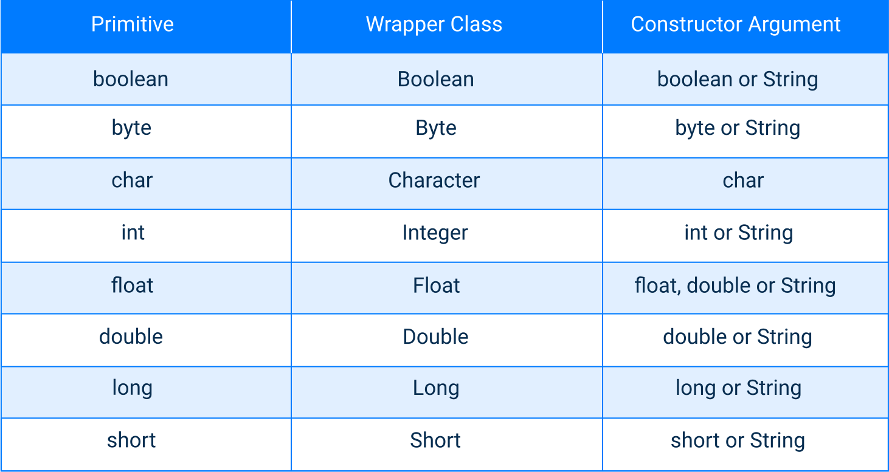

# Empaquetas y desempaquetar
Cada tipo primitivo tiene una clase dedicada a el. Estas clases se conocen como **contenedores** y son **inmutables**. Las clases contenedoras se pueden utilizar en diferentes situaciones.
- Cuando una variable puede ser `null` (ausencia de valor).
- Cuando necesite almacenar valores en colecciones genericas.
- Cuando desee utilizar metodos especiales de estas clases.  

La siguiente tabla enumera todos los tipos primitivos y las clases contenedoras correspondientes.

Java proporciona ocho clases contenedoras: una para cada tipo primitivo La tercera columna muestra el tipo de argumento necesario para que pueda crear una objeto de la clase contenedora correspondiente.  
El **empaquetado** es la conversion de tipos primitivos a objetos de las clases contenedoras correspondientes. El **desempaquetado** es el proceso inverso. El siguiente codigo ilustra ambos procesos:
~~~java
int primitive = 100;
Integer reference = Integer.valueOf(primitive); // empaquetado
int anotherPrimitive = reference.intValue(); // desempaquetado
~~~
**Autoboxing** y **Auto-unboxing** son conversiones automaticas realizadas por el compilador de Java.
~~~java
double primitiveDouble = 10.8;
Double wrapperDouble = primitiveDouble; // autoboxing
double anotherPrimitiveDouble = wrapperDouble; // auto-unboxing
~~~
Autoboxing solo funcionana cuando las partes izquierda y derecha de una tarea tienen el mismo tipo. En otros casos, obtendra un error de compilacion.
~~~java
Long n1 = 10L; // OK, asigna long a Long
Integer n2 = 10; // OK, asigna int a Integer

Long n3 = 10; // MAL, asigna int a Long
Integer n4 = 10L; // MAL, asigna long a Integer
~~~
Las clases contenedoras tienen contructores para crear objetos de otros tipos. Por ejemplo, se puede crear un objeto de una clase contenedora a partir de una cadena (excepto la clase `Character`).
~~~java
Integer number = new Integer("10012");
Float f = new Float("0.01");
Long longNumber = new Long("10000000");
Boolean boolVal = new Boolean("true");
~~~
Tambien puede crear objetos de envoltorio utilizando metodos especiales:
~~~java
Long longVal = Long.parseLong("1000");
Long anotherLongVal = Long.valueOf("2000");
~~~
Si la cadena de entrada tiene un argumento no valido (por ejemplo `"1d0o3"`), ambos metodos lanzan `NumberFormatException`.  
Al igual que para cualquier tipo de referencia, el operador `==` comprueba si dos objetos envoltorios son realmente iguales, es decir, si se refieren al mismo objeto en la memoria. El metodo `equals`, por otro lado, verifica si dos objetos contenedores son significativamente iguales, por ejemplo, verifica si dos contenedores o cadenas tienen el mismo valor.
~~~java
Long i1 = Long.valueOf("2000");
Long i2 = Long.valueOf("2000");
System.out.println(i1 == i2); // false
System.out.println(i1.equals(i2)); // true
~~~
Aunque corresponden a los tipos primitivos, los objetos contenedores son tipos de referencia.  
Hay un posible problema al desempacar. Si el objeto contenedor es `null`, arrojara un `NullPointerException`.
~~~java
Long longVal = null;
long primitiveLong = longVal; // arroja NPE
~~~
Para solucionarlo, podemos agregar una declaracion condicional que produzca un valor predeterminado.
~~~java
long unboxed = val != null ? val : 0; // no arroja NPE
~~~
Otro ejemplo son las operaciones aritmeticas en `Integer`, `Long`, `Double` y otros tipos de contenedores numericos. Pueden causar un **NPE** ya que hay un desempaquetado automatico involucrado.
~~~java
Integer n1 = 50;
Integer n2 = null;
Integer result = n1 / n2; // arroja NPE
~~~
Las clases contenedoras nos permiten representar tipos primitivos como objetos, que son tipos de datos de referencia.
---
## Ejercicios
1. Seleccione todas las formas correctas de inicializar un objeto `Long` con el valor 4321.
~~~java
Long val = 4321L;
Long val = Long.parseLong("4321");
Long val = Long.valueOf("4321");
~~~
2. Implemente un metodo para convertir un `Long` a un `int` manejando diferentes valores.
~~~java
public class Main {

    public static int convert(Long val) {
        if (val == null) {
            return 0;
        } else if (val > Integer.MAX_VALUE) {
            return Integer.MAX_VALUE;
        } else if (val < Integer.MIN_VALUE) {
            return Integer.MIN_VALUE;
        } else {
            return val.intValue();
        }
    }
    
    public static void main(String[] args) {
        Scanner scanner = new Scanner(System.in);
        String val = scanner.nextLine();
        Long longVal = "null".equals(val) ? null : Long.parseLong(val);
        System.out.println(convert(longVal));
    }
}
~~~
3. Implemente un metodo `toPrimitive()`. Debe tomar un `Boolean` y retornar `boolean`. Si se le pasa un `null` el resultado debe ser `false`.
~~~java
class Primitive {
    public static boolean toPrimitive(Boolean b) {
        return Objects.requireNonNullElse(b, false);
    }
}
~~~
