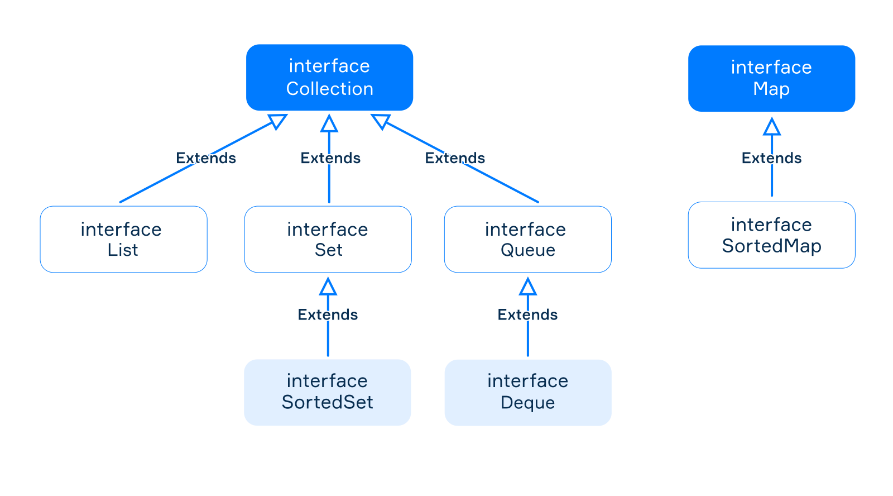

# Que son las Colecciones
Una matriz se inicia con tamaño predefinido durante la creacion. El tamaño no se puede cambiar en el futur, y eso impone algunas limitaciones en su uso para resolver problemas comerciales. Si queremos almacenar mas datos, debemos crear una nueva matriz mas grande y luego copiar los datos en esta matriz manualmente. Esto puede ser ineficiente para programas que procesan una gran cantidad de datos.  
Las **colecciones** se utilizan para almacenar, recuperar, manipular y comunicar datos agregados. Son mas sofisticasdas y flexibles que las matrices. En primer lugar, son **redimensionables**. Puede agregar cualquier cantidad de elementos a una coleccion. Una coleccion manejara automaticamente la eliminacion de un elemento desde cualquier posicion. El segundo punto es que las colecciones proporcionan un amplio conjunto de **metodos** que ya estan implementados para usted.

## Caracteristicas de las coleccion
Hay varias caracteristicas de las colecciones en Java:
1. Estan representadas por diferentes clases de la biblioteca estandar de Java.
2. Todas las colecciones modernas usan **tipos genericos**, mientras que las colecciones antiguas **no son genericas**. Solo nos centraremos en las nuevas colecciones. Como genericos regulares, pueden almacenar cualquier tipo de referencia, incluidas las clases definidas por usted.
3. Las colecciones pueden ser **mutables** (agregar o eliminar elementos) e **inmutables** (imposible agregar o eliminar).  
Ademas de las colecciones estandar, hay varias bibliotecas externas con colecciones. Una de esas biblitecas es **Guava Collections**, desarrollada por Google. Puede usarse si las colecciones estandar no son suficientes para resolver sus problemas.

## El ejemplo de coleccion mas simple
Hay un ejemplo de una coleccion simple llamada `ArrayList`. Debe importarlo `import.util.ArrayList`. Funciona de manera similar a una matriz regular, pero no tiene que cambiar su tamaño manualmente para agregar y eliminar elementos.
~~~java
ArrayList<String> list = new ArrayList<>();

list.add("first");
list.add("second");
list.add("third");

System.out.println(list); // [first, second, third]

System.out.println(list.get(0));
System.out.println(list.get(1));
System.out.println(list.get(2));

list.remove("first");

System.out.println(list); // [second third]

System.out.println(list.size());
~~~
Tenga en cuenta que usamos el metodo `get()` para acceder a una elemento por su indice. A diferencia de los arreglos, las colecciones no tienen el operador `[]`.  
Todas las colecciones modernas son genericas, por lo que puede especificar cualquier tipo de referencia como parametro generico y almacenarlo en una coleccion. Pero hay restriccion, las colecciones no pueden almacenar valores primitivos. Debe usar una de las clases contenedoras.
---
 
# Descripcion general del Framework Collections
Java proporciona el **collections framework** que consta de clases e interfaces para estructuras de datos comunmente reutilizables, como listas, matrices dinamicas, conjuntos, etc. El marco tiene una arquitectura unificada para representar y manipular colecciones, lo que permite que las colecciones se utilicen independientemente de los detalles de implementacion a traves de interfaces. El marco incluye:
- Interfaces que representan diferentes tipos de colecciones.
- Implementaciones primarias de las interfaces.
- Implementaciones heredadas de versiones anteriores, colecciones antiguas.
- Implementaciones de proposito especial (como colecciones inmutables).
- Algoritmos representados por metodos estaticos que realizan operaciones utiles en las colecciones.

## Interfaces de uso comun
Hay dos interfaces genericas raiz `Collection<E>` y `Map<K, V>`, y algunas interfaces mas especificas para representar diferentes tipos de colecciones.

La interface `Collection<E>` representa una coleccion abstracta, que es un contenedor para objetos del mismo tipo. Proporciona metodos comunes para todos los demas tipos de colecciones.  
Las interfaces `List<E>`, `Set<E>`, `Queue<E>`, `SortedSet<E>` y `Deque<E>` representan diferentes tipos de colecciones. No puede crear directamente un objeto de ellos ya que son solo interfaces. Pero cada uno de ellos tiene varias implementaciones. Como por ejemplo, la clase `ArrayList` que representa una matriz de tamaño variable, es un representacion principal de la interfaz `List<E>`.  
Otra interfaz raiz es `Map<K, V>` que representa un mapa (o diccionario) para almacenar pares **clave-valor**. En el mundo real, un buen ejemplo de un mapa es una guia telefonica donde las claves son los nombres de tus amigos y los valores son sus numeros telefonicos. La `Map<K, V>` interfaz **no es** un subtipo de la interfaz `Collection`, pero los mapas a menudo se consideran colecciones, ya que son parte del marco de la coleccion y tienen metodos similares. Las interfaces `Map` y `Collection` no se extienden entre si.

## La interfaz Collection
Estos son los metodos comunes proporcionados por la interfaz `Collection`.
- `int size()` devuelve el numero de elementos de la coleccion.
- `boolean isEmpty()` retorna `true` si esta coleccion no tiene elementos.
- `boolean contains(Object o)` retorna `true` si esta  coleccion contiene el elemento especificado.
- `boolean add(E e)` añado un elemento a la coleccion. Retorna `true` si se agrego el elemento, sino retorna `false`.
- `boolean removeAll(Collection<?> collection)` elimina elementos de esta coleccion que tambien estan contenidos en la coleccion especificada.
- `void clear()` elimina todos los elementos de esta coleccion.  

Es posible hacer referencia a cualquier coleccion en particular a traves de esta interfaz base ya que, como sabe, la superclase se puede usar para hacer referencia a cualquier objeto de subclase derivado de esa superclase. Vamos a crear la coleccion `languages` y añadirle tres elementos. 
~~~java
Collection<String> languages = new ArrayList<>();

languages.add("English");
languages.add("Deutsch");
languages.add("Franchais");

System.out.println(languages.size()); // 3
~~~
Este enfoque le permite reemplazar la coleccion concreta en cualquier momento sin cambiar el codigo que la usa. Tambien fomenta la reutilizacion de software al proporcionar una interfaz estandar para colecciones y algoritmos para manipularlas. Puede parecer complicado ahora, pero cuando mas trabaje con colecciones, mas comprensible se volvera.  
Es imposible obtener un elemento por indice a traves de la interfaz `Collection` porque es muy abstracto y no proporciona dicho metodo. Pero si no le importa que coleccion en particular usar, puede trabajar a traves de esta interfaz. Es importante entender que el orden de los elementos en `ArrayList` se conserva. Simplemente no podemos llamar al metodo `get` a traves de la interfaz `Collection`.  

## Iterando sobre colecciones
Si desea iterar sobre todos los elementos de **cualquier** coleccion, puede usar **for-each**.
~~~java
for (String lang : languages) {
    System.out.println(lang);
}

// English
// Deutsch
// Francais
~~~
Si ya esta familiarizado con las referencias de metodos o las expresiones lambda, puede usar otro estilo para las iteraciones usando `forEach(Consumer<T> consumer)`:
~~~java
languages.forEach(System.out::println); // con referencia de metodo
languages.forEach(elem -> System.out.println(elem)); // con expresion lambda
~~~

## Quitar elementos
Tambien es posible eliminar elementos de una coleccion mutable como `ArrayList`.
~~~java
languages.remove("Deutsch");
System.out.println(languages.size()); // 2
~~~
Nuevamente, si ya esta familiarizado con las expresiones lambda, puede invocar al metodo `removeIf` para eliminar todos los elementos que satisfacen el predicado dado:
~~~java
languages.removeIf(lang -> lang.startsWith("E")); // elimina English
System.out.println(languages.size()); // 1
~~~
---

## Ejercicios
1. Implementar el metodo `filterPhones()` que devuelve solo los numeros de telefono que no estan en la lista negra.
~~~java
class CollectionUtils {

    public static Collection<String> filterPhones(Collection<String> phones,
                                                  Collection<String> blacklist) {
        // write your code here
        phones.removeAll(blacklist);
        return phones;
    }
}

class Main {
    public static void main(String[] args) {
        Scanner scanner = new Scanner(System.in);

        Collection<String> phones = Arrays.asList(scanner.nextLine().split("\\s+"));
        Collection<String> blockList = Arrays.asList(scanner.nextLine().split("\\s+"));

        Collection<String> nonBlockedPhones = CollectionUtils.filterPhones(
                new ArrayList<>(phones), new ArrayList<>(blockList));

        System.out.println(nonBlockedPhones.stream()
                .map(Object::toString)
                .collect(Collectors.joining(" ")));
    }
}
~~~
