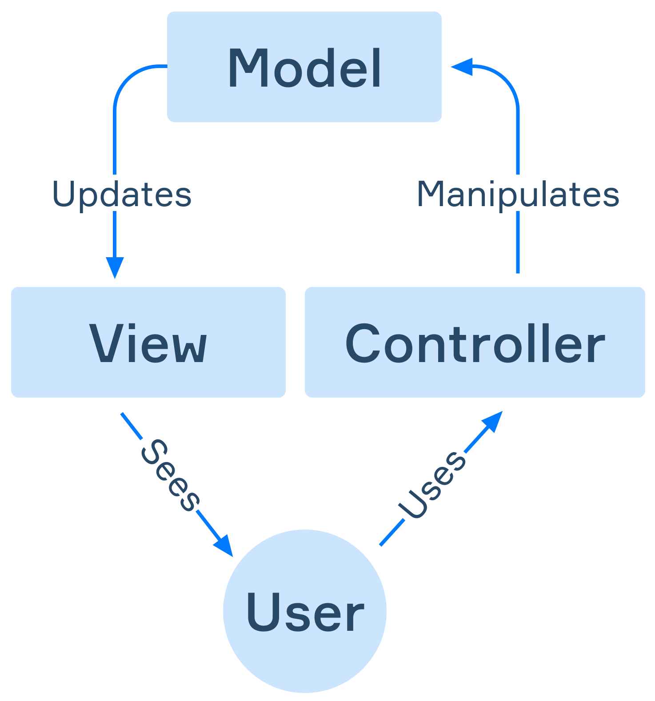

# MVC
MVC describe como separar la interfaz de usuario de la logica comercial y la logica de acceso a datos. De esta manera, la interfaz de usuario se puede modificar de forma independiente, por lo que hay bajo acoplamiento entre las diferentes partes de la aplicacion.  
**MVC (Mode-View-Controller)** es un patron arquitectonico  que separa una aplicacion en tres componentes logicos:
- **Model** es responsable de todos los datos y su logica relacionada.
- **View** es responsable de presentar datos a los usuario o manejar la interaccion del usuario.
- **Controller** informa al modelo de la necesidad de cambios.  
Para entender como trabajar con estos componentes, considere el siguiente ejemplo.

Cuando el usuario hace clic en los elementos de la interfaz, interactua con el **controller**. El **controller** aceptala entrada del usuario e interactura con el **model**. El **model** representa el estado de una aplicacion. Pueden ser datos en una base de datos, un archivo, datos en memoria u otra cosa. Despues de la modificacion, el **model** actualiza la **view** y su usuario ve la actualizacion.  

## Ventajas y Desventajas de MVC
MVC se ha convertido en un patron codificado y ha sido ampliamente utilizado debido a sus beneficios.
- Al separarse en componentes, se aumentan la flexibilidad, la capacidad de mantenimiento y la escalabilidad de la aplicacion.
- Puede probar los componentes por separado unos de otros.
- Los componentes se pueden reutilizar.
- Los modelos pueden tener varias vistas.
- MVC le permite configurar diferentes niveles de seguridad para diferentes componentes.  
Estas son las desventajas de MVC:
- Hay que tener en cuenta que no es adecuado para aplicaciones pequeñas. Hace que las aplicaciones simples sean mas complejas.
- MVC tampoco es adecuado para aplicaciones de alto rendimiento. A veces es mas eficiente pasar por varias capas de arquitectura.

## Introduccion a Spring Web MVC
**Spring Web MVC**, comunmente conocido como **Spring MVC**, es uno de los modulos del marco principal de Spring. Spring MVC se utiliza para crear sitios web y servicios RESTful. Proporciona componentes listos que simplifican y aceleran el proceso de desarrollo.  
Las aplicaciones comunmente creadas con Spring MVC se pueden describir por el tipo de datos que devuelven:
- **HTML**: la aplicacion crea paginas web que se pueden ver a traves de un navegador web (cliente). Este tipo de aplicacion utiliza completamente el patron MVC subyacente. El modelo almacena los datos de la aplicacion. La vista es responsable de representar los datos del modelo y generar las salida HTML. El controlador procesa las solicitudes de los usuarios, crea un modelo adecuado y lo pasa a la vista para su representacion.
- **JSON/XML**: La aplicacion proporciona servicios RESTful que generan datos JSON o XML. Varios tipos de clientes, incluidos otros servicios, pueden utilizar este tipo de datos. La estructura de este tipo de programa es similar al primer tipo, pero View esta ausente y Spring MVC ya no es responsable de el. En su lugar, se devuelven datos XML/JSON y alguno otro programa (cliente) es responsable de representar y visualizar los datos del modelo devuelto.  

## Dependencia
Para desarrollar y ejecutar una aplicacion web Spring MVC en Spring Boot, debemos incluir la siguiente dependencia en el proyecto Spring Boot.
~~~gradle
dependencies {
    // ...
    implementation 'org.springframework.boot:spring-boot-starter-web'
    // ...
}
~~~

## Servidor Web
Como probablemente sepa, la diferencia entre una aplicacion web y una aplicacion habitual es que una aplicacione web requiere un servidor web, un programa especial que se utiliza para ejecutarla.  
Un servidor se llama embebido cuando forma parte de una aplicacion y no necesitamos instalarlo por separado. Esto es conveniente porque nos permite empaquetar toda la aplicacion en un ejecutable. Un archivo `.jar` que podemos mover y ejecutar como una aplicacion normal. El servidor incorporado predeterminado es **Apache Tomcat**.  

## Log
Supongamos que comenzamos un nuevo proyecto Spring Boot y solo agregamos una dependencia web sin ningun codigo. Si ejecutamos una aplicacion de este tipo, iniciara el servidor Tomcat incorporado y veremos nueva informacion de registro relacionada con Spring MVC en la consola.  
La primera linea relacionada con Spring MVC contiene la siguiente informacion.
~~~java
... Tomcat initialized with port(s): 8080 (http)
~~~
La linea muestra que Tomcat se esta iniciando en el puerto `8080`. Este es el puerto determinado proporcionado por la configuracion automatica. Le sigue una inicializacion adicional y vemos una linea que contiene la version de Apache Tomcat:
~~~java
... Starting Servlet engine: [Apache Tomcat/9.0.45]
~~~
Despues de esto, sigue mas inicializacon, y la ultima linea relacionada con Spring MVC contiene la siguiente informacion.
~~~java
... Tomcat started on port(s): 8080 (http) with context path ''
~~~
La linea indica que la inicializacion se completo con exito y el servidor Tomcat se esta ejecutando. Tambien muestra la ruta de contexto.  
La **ruta de contexto** es el perfijo de una ruta URL en la que podemos acceder a la aplicacion. Tambien se conoce como subruta o subdirectorio. Como podemos ver, la ruta de contexto predeterminada esta vacia. Significa que se puede acceder a la aplicacion web desde `http://localhots:8080/`, las aplicaciones a menudo se alojan en otro lugar que no sea la ruta de contexto predeterminada. Por ejemplo, una ruta de contexto como `blog` significa que se puede acceder a la aplicacion a traves de una URL como `http://localhost:8080/blog`. Una ruta de contexto tambien se puede anidar: `blog/v1`.

## Pagina web
Para completar la aplicacion, crearemos una archivo HTML simple en una carpte responsable del contenido estatico y luego lo abriremos a traves de un navegador web. La ubicacion de la carpeta es `/resources/static`. Vamos a crear una `index.html` con el siguiente contenido.
~~~html
<!DOCTYPE html>
<html lang="en">
<head>
    <meta charset="UTF-8">
    <title>Main</title>
</head>
<body>
    <h1>Welcome!</h1>
</body>
</html>
~~~
Ahora, si ejecutamos la aplicacion nuevamente y apuntamos nuestro navegador web a `http://localhost:8080/`, veremos la pagina web. Ademas, podemos acceder al archivo por su nombre: `http://localhost:8080/index.html`.  

## Configuracion
Por lo general, es una buena idea preferir la configuracion automatica, pero hay casos en los que es posibles que deseemos tener una ruta o puerto de contexto personalizado, asi como cambiar algunas otras propiedades de la aplicacion. Podemos hacer eso en el archivo `application.properties`.
~~~java
server.port=9090
~~~
Y asi es como puede cambiar la ruta de contexto en Spring boot.
~~~java
server.servlet.context-path=/myapp
~~~
Si cambiamos el puerto y la ruta de contexto y volvemos a ejecuta la aplicacion, veremos que el registro en la consola incluye estos cambios.
~~~java
... Tomcat started on port(s): 9090 (http) with context path '/myapp'
~~~
A partir de ahora, se puede acceder a una aplicacion web desde `http://localhost:9090/myapp`.