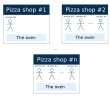
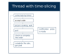

# Procesos y Threads
Imagina que llegas a un patio de comidas a la hora del almuerzo y ves una fila de pizzerias alli mismo. La mision de cada tienda es vender pizzay cada una de ellas tiene varios trabajadores. Su proposito es vender pizza tambien, pero no pueden venderla solos sin un equipo provisto por la tienda. Por otro lado, cualquier pizzeria no puede vender nada sin su personal. Tiene que haber al menos un trabajador para hacer el trabajo.  
Es similar a como una computadora ejecuta aplicaciones y administra la multitarea y la ejecucion en paralelo. Para entenderlo mejor, consideremos conceptos como **procesos** e **hilos**, asi como algunas similitudes entre estas nociones de informatica y las propiedades de una pizzeria.

## Proceso
El **proceso** es la unidad autonoma de ejecucion que tiene todo lo necesario para cumplir la mision. En resumen, el proceso es el contenedor de sus hilos, todas las necesidades para su trabajo y sus recurso compartidos. Es mas barato organizar el acceso a los recursos compartidos una vez que hacerlo cada vez que se genera un nuevo hilo. El proceso debe tener al menos un subproceso, ya que ellos hacen todo el trabajo. No existe tal cosa como un hilo sin un proceso o un proceso sin al menos un hilo.  
Si observamos el negocio de la pizza, una sola pizzeria servira como analogia para el proceso. Tiene todo el ambiente y el equipo requerido para que un trabajador haga el trabajo. El equipo es caro, por lo que es mas barato y eficiente cuando los trabajadores los comparten. No es necesario que cada trabajador adquiera equipo personal. Por otro lado, la tienda no puede hacer nada sin los trabajadores. Es imprescindible contar con al menos un trabajador porque sin el todo el equipo seria inutil. En conjunto, estas cosas forman un proceso de elaboracion y venta de pizza.

## Hilo
En informatica, el **hilo** de ejecucion es un flujo de instrucciones dentro de un proceso que se puede programar y ejecutar de forma independiente. Cada subproceso tiene su ejecutor, y este ejecutor solo puede ejecutar un subproceso a la vez. Varios subprocesos dentro del mismo proceso pueden ejecutarse simultaneamente en paralelo.  
Para comprender lo que significa el termino **hilo**, piense en los empleados de una pizzeria. Trabajan de acuerdo a sus descripciones de trabajo. Completan varias tareas de acuerdo con las reglas establecidas por la tienda utilizando recursos compartidos otorgados por la tienda.  
Los trabajadores de una pizzeria hacen el papel de ejecutores de hilos. Las tareas que realizan los trabajadores son los hilos en el "proceso" de la pizzeria.  

## Concurrencia interna o ligera
Los trabajadores pueden desempeñar diferentes roles durante el proceso de venta de pizza. Cada uno de ellos puede ser simultaneamente vendedor, cajero o cocinero en diferentes puntos del proceso. Esta concurrencia no es entre los trabajadores sino entre los roles que desempeña cada trabajador. Un aspecto importante de estos roles es que sus tareas suelen ser lo suficientemente rapidas y no requieren una cantidad considerable de tiempo ni recursos compartidos. Son **livianos**.  
Si las tareas son livianas y no requieren acceso a ningun recurso compartido, excepto el tiempo y la atencion del ejecutor, no es necesario ejecutarlas en diferentes subprocesos. Es mas economico organizar su ejecucion concurrente con division de tiempo **dentro de un hilo**. la concurrencia de este tipo se llama interna por razones obvias. A menudo, tambien se le llama ligero porque las tareas dentro de un subproceso de este tipo suelen ser pequeñas y rapidas.  
La siguiente imagen representa un ejemplo de un posible subproceso de trabajo con simultaneidad liviana mediante division de tiempo.

---

# Hilos como objetos
Java se diseño originalmente con soporte integrad de subprocesos multiples. Los subprocesos se admiten a nivel de JVM, a nivel de idioma mediante palabras clave especiales y a nivel de biblioteca estandar. Cada programa Java tiene al menos un hilo, que se llama **main**, creado automaticamente por el proceso JVM para ejecutar sentencias dentro del metodo `main`.  
A lo largo de todas las etapas de desarrollo del lenguaje Java, el enfoque de subprocesos multiples ha cambiado desde el uso de subprocesos de bajo nivel a algunas abstracciones de alto nivel. Sin embargo, comprender la base fundamental sigue siendo muy importante para un buen desarrollador.  
Cada subproceso esta representado por un objeto que es una instancia de `java.lang.Thread`. Esta clase tiene un metodo estatico llamado `currentThread` para obtener una referencia al objeto de subproceso que se esta ejecutando actualmente.
~~~java
Thread thread = Thread.currentThread(); // el hilo actual
~~~
Cualquier hilo tiene un nombre, un identificador (`long`), una prioridad y algunas otras caracteristicas que se pueden obtener a traves de sus metodos.

## La informacion sobre el hilo main
El siguiente ejemplo demuestra como obtener las caracteristicas del hilo **main** haciendo referencia a el a traves de un objeto de la clase `Thread`.
~~~java
public class MainThreadDemo {
    public static void main(String[] args) {
        Thread t = Thread.currentThread(); // main thread

        System.out.println("Name: " + t.getName());
        System.out.println("ID: " + t.getId());
        System.out.println("Alive: " + t.isAlive());
        System.out.println("Priority: " + t.getPriority());
        System.out.println("Daemon: " + t.isDaemon());

        t.setName("my-thread");
        System.out.println("New name: " + t.getName());
    }
}
~~~
Todas las declaraciones en este programa son ejecutadas por el hilo **main**.  
La invocacion `t.isAlive()` retorna si el subproceso se ha iniciado y aun no ha muerto. Cada hilo tiene una **prioridad**, y el `getPriority()` devuelve la prioridad de un hilo dado. Los subprocesos con una prioridad mas alta se ejecutan con preferencia a los subprocesos con prioridades mas bajas. La invocaion `t.isDaemon()` comprueba si el hilo es un **daemon**. Un subproceso daemon es un subproceso de baja prioridad que se ejecuta en segundo plano para realizar tareas como la recoleccion de elementos no utilizados, etc. JVM no espera subprocesos daemos antes de salir mientras espera subprocesos que no son daemon.  
La salida del programa se vera asi:
~~~java
Name: main
ID: 1
Alive: true
Priority: 5
Daemon: false
New name: my-thread
~~~
