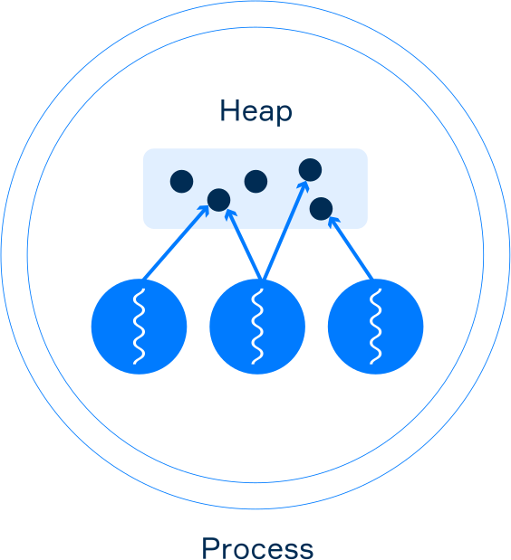

# Datos compartidos

## Compartir datos entre hilos
Los subprocesos que pertenecen al mismo proceso comparten la memoria comun (que se llama **Heap**). Pueden comunicarse mediante el uso de datos compartidos en la memoria. Para poder acceder a los mismos datos desde multiples subprocesos cada subproceso debe tener una referencia a estos datos.

**Multiples subprocesos de un solo proceso tienen referencias a objetos del monton**  
Consideremos un ejemplo. Aqui hay una clase llamada `Counter`.
~~~java
class Counter {

    private int value = 0;

    public void increment() {
        value++;
    }

    public int getValue() {
        return value;
    }
}
~~~
La clase tiene dos metodos: `increment` y `getValue`. Cada invocacion de `increment` agregar 1 al campo `value` y llamando a `getValue` devuelve el valor actual del campo. Y aqui hay una clase que extiende a `Thread`:
~~~java
class MyThread extends Thread {

    private final Counter counter;

    public MyThread(Counter counter) {
        this.counter = counter;
    }

    @Override
    public void run() {
        counter.increment();
    }
}
~~~
El constructor de `MyThread` toma una instancia de `Counter` y lo almacena en el campo. El metodo `run()` invoca el metodo `increment()` del objeto `counter`.  
Ahora vamos a crear una instancia de `Counter` y dos instancias de `MyThread`. Ambas instancias de `MyThread` tienen la misma referencia al objeto `counter`.
~~~java
Counter counter = new Counter();
MyThread thread1 = new MyThread(counter);
MyThread thread2 = new MyThread(counter);
~~~
Ahora veamos que sucede cuando comenzamos ambos hilos uno por uno e imprimimos el resultado de `counter.getValue()`.
~~~java
thread1.start(); // inicia el primero hilo
thread1.join(); // espera por el primer hilo

thread2.start(); // inicia el segundo hilo
thread2.join(); // esperar por el segundo hilo

System.out.println(counter.getValue()); // imprime 2
~~~
Como puedes ver si lo intentas por ti mismo el resultado es 2, porque ambos hilos trabajan con los mismos datos usando una referencia.  
En este ejemplo, comenzamos el primero subproceso y esperamos hasta que completo su trabajo (en ese momento ocurrio un incremento), luego comenzamos el segundo subproceso y esperamos hasta que tambien se completo su trabajo (el incremento sucedio nuevamente).

## Interferencia de hilo
Una operacion no atomica es una operacion que consta de varios pasos. Un subproceso puede operar en un valor intermedio de operacion no atomica realizada por otro subproceso. Esto conduce a una problema llamado **interferencia de subprocesos**: las secuencias de pasos de operaciones no atomicas realizadas por varios subprocesos pueden superponerse.  
Comencemos explicando por que **el incremento** es una operacion no atomica y como funciona exactamente. Como ejemplo, considere la clase `Counter` otra vez.
~~~java
class Counter {

    private int value = 0;

    public void increment() {
        value++; 
    }

    public int getValue() {
        return value;
    }
}
~~~
En el ejemplo anterior, los dos subprocesos no trabajaron con los datos al mismo tiempo. Antes del inicio del segundo hilo, el primero ya ha terminado.  
La operacion `value++` se puede descomponer en tres pasos:
1. leer el valor actual
2. incrementar el valor en 1
3. escribir el valor incrementado de nuevo en el campo.  
Dado que la operacion de incremento no es atomica y toma 3 pasos para trabajar, la **interferencia del subproceso** puede ocurrir en caso de que dos subprocesos llamen al metodo `increment` de la misma instancia de `Counter`.  
Supongamos que tenemos una instancia de la clase `Counter`:
~~~java
Counter counter = new Counter();
~~~
El valor inicial del campo es 0.  
Ahora si `Thread A` invoca el metodo `increment` de esta instancia y `Thread B` tambien invoca el metodo al mismo tiempo, ocurre lo siguiente:
1. **Subproceso A**: lee el valor de la variable
2. **Subproceso B**: incrementa el valor de lectura en 1
3. **Hilo B**: lee valor de la variable (lee un valor intermedio 0)
4. **Hilo A**: escribe el resultado en la variable (ahora, el valor del campo es 1)
5. **Subproceso B**: incrementa el valor de lectura en 1
6. **Hilo B**: escribe el resultado en la variable (ahora, el valor actual del campo es 1).  
En este caso despues de llamar al metodo `increment` de dos hilos podemos obtener el resultado inesperado (1 en lugar de 2). Eso significa que el resultado de `Thread A` se perdio, sobrescrito por `Thread B`. Aunque a veces el resultado puede ser correcto, este intercalado particular es posible.  
Acabamos de ver como el incremente y el decremento son operaciones no atomicas. En este tema, no discutiremos como se puede resolver este problema, solo tengalo en cuenta por ahora.  
Consideremos otro caso: una asignacion de valores de 64 bits. Puede ser sorprendente, pero incluso los campos de lectura y escritura de `double` y `long` (64 bits) pueden no ser atomicos en algunas plataformas.
~~~java
class MyClass {
    long longVal; // leer y escribir puede no ser atomico
    double doubleVal; // leer y escribir puede no ser atomico
}
~~~
Significa que mientras un subproceso escribe un valor en una variable, otro subproceso puede acceder a una resultado intermedio (por ejempl, solo 32 bits escritos). Para que estas operacioens sean atomics, los campos deben declararse utilizando la palabra clave `volatile`.
~~~java
class MyClass {
    volatile long longVal; // escribiendo y leyendo son atomicas ahora
    volatile double doubleVal; // escribiendo y leyendo son atomicas ahora
}
~~~
Se garantiza que la lectura y escritura en los campos de otros tipos primitivos (boolean, byte, short, int, char, float) sea **atomica**. En aplicaciones grandes, las **interferencias de subprocesos** pueden ser dificiles de detectar.  

## Visibilidad entre hilos
A veces, cuando un subproceso cambia los datos compartidos, otro subproceso puede no notar estos cambios u obtenerlos en un orden diferente. Significa que diferentes subprocesos pueden tener vistas inconsistentes de los mismo datos.  
Las razones son diferentes, incluido el almacenamiento en cache de valroes para subprocesos, la optimizacion del compilador y mas. Afortunadamente, la mayoria de los programadores no necesitan una comprension detallada de las causas. Todo lo que se necesita es una estrategia para evitarlos en primer lugar.  
**Ejemplo**. Aqui hay un campo `int`, definido e inicializado:
~~~java
int number = 0;
~~~
El campo se comparte entre dos hilos: `Thread A` y `Thread B`. `Thread A` incrementa el `number` por 5.
~~~java
number += 5;
~~~
Justo despues, `Thread B` huellas dactilares `number` en la salida estandar.
~~~java
System.out.println(number);
~~~
La salida puede ser 0 o 5, porque no hay garantia de que el cambio realizado por `Thread A` es visible para `Thread B`.  
Como ya hemos mencionado, la palabra clave `volatile` se utiliza para la **visibilidad**. Para hacer cambios visibles de un valor realizado por un hilo a otros hilos, debemos declarar el campo con la palabra clave `volatile`.
~~~java
volatile int number = 0;
~~~
Cuando el campo se declara como **volatil**, se garantiza que todos los cambios realizados en este campo por un subproceso seran visibles para otro subproceso cuando este leyendo el valor de este campo. La palabra `volatile` se puede escribir en una declaracion de instancia y en campos estaticos.  

## Otros casos de visibilidad
A veces no necesitamos escribir `volatile`. Los siguientes procedimientos tambien garantizan la visibilidad.
- Los cambios de variables realizados por un subproceso **antes de iniciar** un nuevo subproceso siempre son visibles para el nuevo subproceso.
- Los cambios de variables dentro de un subproceso siempre son visibles para cualquier otro subproceso despues de que regresa con exito de un `join` en el hilo.  
No consideraremos todas las formas existentes para garantizar la visibilidad ahora. Se formalizan mediante una relacion especial denominada **"Sucede antes"**.  
Nuevamente, la palabra `volatile` nos permite hacer cambios visibles de un campo realizado por un hilo a otros hilos. Esta palabra clave tambien hace que escribir a `double` y `long` a campos atomicos. Pero la palabra clave no hace que el incremento/decremento y operaciones similares sean atomicas.
---
 
## Ejercicios
1. Si un campo tiene la palabra `volatile` eso podria significar.
- Si el campo es cambiado en un hilo, ese cambio sera siempre visible para otros hilos.
- Asignar un valor de tipo primitivo a ese campo es una operacion atomica.
2. Existen tres campos en una clase, cuales operaciones son **atomicas**.
~~~java
double d = 0.0d;
char ch = 'a';
volatile long lg = 0L;

// ch = 'e';
// lg = 900_000L
~~~