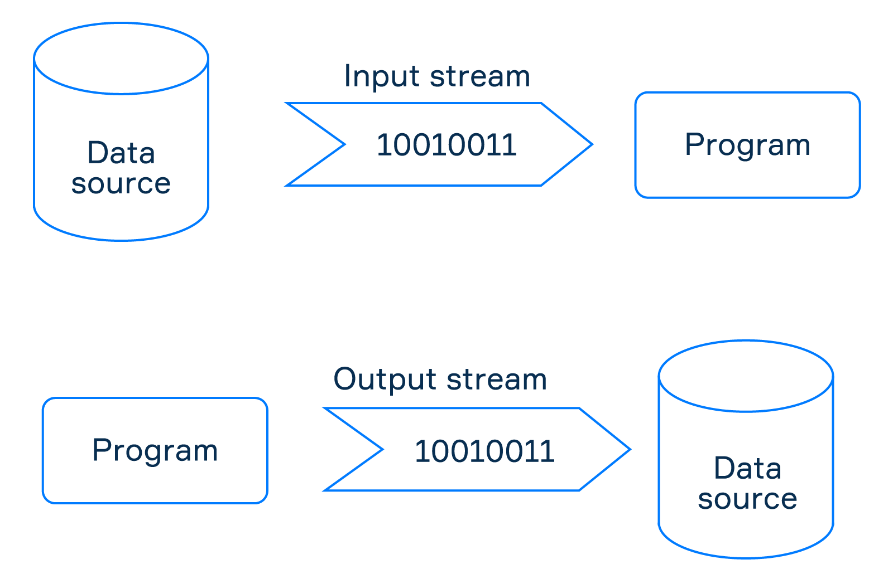

# Que son Streams
A veces, su programa debe procesar datos ubicados fuera de el o guardar los resultados en un destino externo. Java proporciona una abstraccion llamada **stream** (flujo) que unifica el trabajo con discos, archivos, ubicaciones de red y otros recursos.  

## Flujos de entrada y salida
En cierto sentido, un flujo de Java es similar a un flujo de agua del mundo real que tiene un comienzo (fuente) y un final (destino). Segun los mismo principios, los flujos de I/O se pueden clasificar en dos grupos.
- **flujos de entrada**, que lee datos de una fuente
- **salida de flujo**, que escribe datos en un destino especifico.  
La siguiente imagen lo demuestra.

De hecho, ya conoce dos ejemplos especificos de flujos I/O: **System.in** y **System.out**. Los usamos para leer/escribir datos desde/hacia la consola.

## Flujos de bytes y caracteres
Los flujos se pueden clasificar en dos categorias en funcion de como representan secuencias de datos:
- **flujos de bytes** que se utilizan para leer y escribir datos en bytes
- **flujos de caracteres** que se utilizan para leer y escribir datos en caracteres segun el formato Unicode de 16 bits.  
Los flujos de caracteres facilitan mucho el procesamiento de datos de texto para los programadores. En comparacion con ellos, los flujos de bytes tienen un nivel bastante bajo, pero pueden funcionar con datos de cualquier tipo, incluidos los multimedia.  

## Flujos amortiguados
Algunas transmisiones usan una ubicacion de memoria temporal. Al principio, estos flujos leen o escriben datos en una ubicacion temporal y luego los datos se trasladan a un origen o destino desde alli. Esta ubicacion temporal suele ser una matriz de bytes o caracteres denominada **buffer**, y todo el proceso se denomina **buffering**. la razon por la que se introduce una ubicacion de memoria intermedia es que apelar a algunas fuentes o destinos requiere un intervalo de tiempo considerable. Entonces, el almacenamiento en bufer es un tipo de optimizacion que minimiza el numero de interacciones con ellos.  
Veamos como funciona el almacenamiento en bufer en los flujos de salida. Cuando escribe datos en la secuencia, primero se acumulan en un bufer. Una vez que el bufer esta lleno, todos los datos almacenados se escriben en el destino.  
Algunos flujos de entrada tambien tienen una funcion de almacenamiento en bufer. Cuando una secuencia lee datos por primera vez, lee todo lo que puede contener un bufer. Incluso si solo se solicitaron unos pocos bytes o caracteres, el flujo de entrada almacenado en el bufer leera bytes hasta que el bufer este lleno. La siguiente lectura primero verifica si hay datos no leidos en el bufer. En caso de que el bufer contenga algunos datos no leidos, la secuencia los toma del bufer y no tiene que interactuar con la fuente. De lo contrario, solicita datos de la fuente como la primera vez.
---

## Ejercicios
1. El soporte tecninoc de una libreria decidio automatizart el sistema de informes diarios. El equipo planea crear un programa que se ejecutara el final del dia para crear el informa *daily_total.csv*. Para hacer eso, el programa debe recuperar automaticamente el archivo *daily_sales.csv*, que contiene todas las transacciones de venta que la tienda realizo durante ese dia. Dichos datos de ventas diarias se pasaran a traves de canalizaciones. Color los pasos del algoritmo en el orden correcto.
- Abrir *daily_sales.csv*
- Leer datos usando **Input Stream**
- Procesar datos
- Crear un **Output Stream**
- Escribir datos en *daily_total.csv*
2. Que son **Char Streams**
- datos unicode de 16-bit
3. Que hay siempre al comienzo de una canalizacion de flujo?
- Fuente (Source)
4. Cuando se escriben en el destino los datos almacenados en el **buffer**?
- Una vez que el **buffer** esta lleno
5. Por que tenemos que usar **Streams** en Java
- Los **Streams** permiten que las aplicaciones de Java envien/reciban datos de diferentes fuentes
6. Conecte el concepto con su definicion
- **Input Stream**: Lee datos de una fuente
- **Output Stream**: Escribe datos en un destino especifico
- **Byte Streams**: Se usan para leer y escribir datos en bytes
- **Char Streams**: Se usan para leer y escribir datos en caracteres de acuerdo al formato unicode de 16-bit
- **Buffered Streams**: Usan una localizacion en memoria temporal.
7. A veces, desea minimizar las interacciones con la fuente cuando utiliza secuencias, ¿Que tipo de flujos necesitas?
- **Buffered Streams**
---

# Input Streams
Como regla general, cada programa consume algunos datos como una forma de comunicarse con el mundo exterior. Puede ser una entrada de usuario desde la consola, un archivo de configuracion u otra cosa. Java tiene un mecanismo comun para consumir datos llamados **Input Streams**.  
Los datos se pueden obtener de muchos puntos considerados como proveedores. Ademas de la entrada estandar o los archivos, pueden ser conexiones de red, buferes en memoria o incluso objetos. Todos ellos se denominas **Sources** para flujos de entrada. De hecho, una fuente es cualquier datos que puede ser consumido y procesados por un programa. Trabajar con datos es algo bastante especifico, y cada fuente necesita una clase especializada.  

## Character Streams
Hay varias clases para leer texto. Se denominan flujos de entrada de caracteres y permiten leer datos de texto: `char` o `String`. Por ejemplo, hay `FileReader`, `CharArrayReader`, `StringReader`, etc.  
Cada clase proporciona un conjunto de metodos utiles, mientras que tambien tienen metodos comunes para leer datos.
- `int read()` lee un solo caracter. Si se llega al final de la secuencia, el metodo devuelve el valor `-1`. En caso contrario, devuelve la representacion numerica del caracter segun la codificacion actual.
- `int read(char[] cbuf)` lee una secuencia de caracteres en la matriz pasada hasta su capacidad y devuelve el numero de caracteres que realmente se leyeron. Tambien puede volver `-1` en caso de que no se hayan leido datos
- `int read(char[] sbuf, int off, int len)` lee caracteres en una parte de una matriz.  
Estos metodos devuelven el numero de caracteres que realmente se leyeron o `-1`. Tambien bloquean la ejecucion del programa hasta que haya alguna entrada disponibles o se alcance el final de la secuencia. 
Otro metodo importante es `void close()` que debe invocarse despues de que uso una secuencia.  

## Ejemplo de Characters Streams
Consideremos `FileReader` como ejemplo de la clase `Reader`, `FileReader` tiene un conjunto de constructores. Estos son algunos de ellos.
- `new FileReader(String fileName)`
- `new FileReader(String fileName, Charset charset)`
- `new FileReader(File file)`
- `new FileReader(File file, Charset charset)`  
Como puede ver, puede leer datos de texto del archivo indicado por una ruta `String` o como un objeto `File`.  
Ahora intentemos leer un archivo. Digamos que tenemos un archivo `file.txt` con el siguiente contenido: `input stream`.
~~~java
Reader reader = new FileReader("file.txt");

char first = (char) reader.read(); // i
char second = (char) reader.read(); // n

char[] others = new char[12];
int numbers = reader.read(others); // 10

System.out.println(others);
// ['p', 'u', 't', ' ', 's', 't', 'r', 'e', 'a', 'm', '\u0000', '\u0000']
~~~
Expliquemos los resultados. Como hemos leido las dos primeras letras en otras variables, los primeros 10 caracteres de `others` se rellenan a partir de la tercera letra. Cuando la secuencia llego al final del archivo, dejo de leerse, por lo que los dos ultimos caracteres no se actualizan.  
Cuando crea una matriz vacia, en realidad se llena con los valores predeterminados, que son `'\u0000'` para una matriz de caracteres. Esta es la razon por la cual los ultimos 2 elementos de others son `'\u0000'`.  
Lo complicado aqui es que `'\u0000'` se interpreta como un simbolo vacio y no se muestra en absoluto, aunque tecnicamente esta presente. Recuerde eso cuando lee los datos de una en una matriz.  
Otra forma comun de leer un flujo de datos de texto es leerlo caracter por caracter hasta que se cierre el flujo:
~~~java
FileReader reader = new FileReader("file.txt");

int charAsNumber = reader.read();
while (charAsNumber != -1) {
    char character = (char) charAsNumber;
    System.out.println(character);
    charAsNumber = reader.read();
}
reader.close();
~~~
Cuando devuelve `-1`, significa que se alcanzo el final de la secuencia, por lo que no queda nada por leer.  

## Byte Streams
Los flujos de bytes pueden parecer mas complicados, asi que comencemos con algo que ya sabe. Para leer algunos datos de texto de la entrada estandar, podemos crear una instancia de `Scanner`.
~~~java
Scanner scanner = new Scanner(System.in);
~~~
`System.in` aqui realmente es un ejemplo de un flujo de entrada de bytes. Hay otras clases de flujo de bytes especializadas: `ByteArrayInpuStream` se utiliza para leer de `byte[]`, `FileInputStream` esta dedicado para archivos, `AudioInputStream` es una forma de consumir una entrada de audio.  
Todas las clases de flujo de bytes tienen metodos para ler  similares a los flujos de entrada de caracteres:
- `abstract int read()` lee un solo byte
- `int read(byte[] b)` lee una cantidad de bytes y los almacena en una matriz de bytes
- `byte[] readAllBytes()` lee todos los bytes.  
El metodo que lee bytes en una matriz, devuelve un valor `int`. Es el numero de bytes que realmente se leyeron de la fuente. Si devuelve `-1`, es una señar de que no se leyeron bytes.  
Cada clase de flujo de entrada tambien tiene un metodo `void close()` para liberar recursos del sistema.  

## Ejemplo de Byte Streams
Supongamos que tenemos un archivo `file.txt` que contiene el siguiente texto: `input stream`. Leamoslo usando la clase `FileInputStream`. Se puede crear usando varios constructores, tales como:
- `new FileInputStream(String pathToFile)`
- `new FileInputStream(File file)`
Aqui creamos un flujo de entrada de archivos especificando el nombre del archivo.
~~~java
FileInputStream inputStream = new FileInputStream("myFile.txt");
~~~
Vamos a leer los primeros cinco bytes:
~~~java
byte[] bytes = new byte[5];
int numberOfBytes = inputStream.read(bytes);
System.out.println(numberOfBytes); // 5
inputStream.close();
~~~
Ahora `bytes` contiene `['i', 'n', 'p', 'u', 't']`. El enfoque de byte por byte tambien funciona aqui, similar al ejemplo de secuencias de caracteres.

## ¿Que tipo de flujo debo usar?
La principal diferencia entre los flujos de bytes y de caracteres es que los de bytes leen los datos de entrada como *bytes*, mientras que los de caracteres funcionan con caracteres.  
Una computadora solo entiende secuencias de bytes. Desde esta perspectiva, cualquier dato es un conjunto de bytes y los flujos de entrada de bytes son una forma comun de leer cualquier tipo de datos. Para las computadores, los caracteres siguen siendo combinaciones de bytes definidos por una especificacion de juego de caracteres.  
Por el contrario, como seres humanos, estamos acostumbrados a tratar con secuencias de caracteres. Los flujos de entrada de caracteres estan destinados a leer datos que consisten en caracteres. Bajo el capo, todavia leen bytes, pero inmediatamente codifican bytes a caracteres.  
Si necesita leer un texto, use secuencias de entrada de caracteres. De lo contrario, por ejemplo, mientras lee audio, video, zip, etc. use flujos de entrada de bytes.
---

## Ejemplos
1. Suponga que intenta leer un archivo dentro de un array con una capacidad de 10. Dependiendo del contenido del archivo, que podria imprimir el programa?
~~~java
byte[] bytes = new byte[10];
InputStream inputStream = new FileInputStream("file.txt");
int numberOfBytes = inputStream.read(bytes);
System.out.println(numberOfBytes);

// -1
// 10
// 5
~~~
2. Lea los caracteres de un archivo e imprimalos al reves.
~~~java
class Main {
    // solucion 1
    public static void main(String[] args) throws Exception {
        BufferedReader reader = new BufferedReader(new InputStreamReader(System.in));
        StringBuilder strBuild = new StringBuilder();
        int chars = reader.read();
        while (chars != -1) {
            strBuild.append((char) chars);
            chars = reader.read();
        }
        reader.close();
        System.out.println(strBuild.reverse());
    }

    // solucion 2
    public static void main(String[] args) throws Exception {
        BufferedReader reader = new BufferedReader(new InputStreamReader(System.in));
        char[] input = reader.readLine().toCharArray();
        reader.close();

        for (int i = input.length; i > 0; i--) {
            System.out.print(input[i - 1]);
        }
    }

    // solucion 3
    public static void main(String[] args) throws Exception {
        BufferedReader reader = new BufferedReader(new InputStreamReader(System.in));
        char[] chars = new char[50];
        int number = reader.read(chars);
        for (int i = chars.length - 1; i >= 0; i--) {
            if (chars[i] > 0) {
                System.out.print(chars[i]);
            }
        }
        reader.close();
    }
}
~~~
2. Lee un texto introducido en la consola e imprimelo como una secuencia de bytes. Use `System.in` como flujo de entrada directamente. Evita usar `Scanner`.
~~~java
class Main {

    // solucion 1
    public static void main(String[] args) throws Exception {
        InputStream inputStream = System.in;
        for (byte b : inputStream.readAllBytes()) {
            System.out.print(b);
        }
        inputStream.close();
    }

    // solucion 2
    public static void main(String[] args) throws Exception {
        BufferedReader reader = new BufferedReader(new InputStreamReader(System.in));
        byte[] byteArray = reader.readLine().getBytes();
        for (byte item: byteArray) {
            System.out.print(item);
        }
    }

    // solucion 3
    public static void main(String[] args) throws Exception {
        InputStream inputStream = System.in;
        int data = inputStream.read();
        while (data != -1) {
            System.out.print(data);
            data = inputStream.read();
        }
    }
}
~~~
3. Seleccione todas las declaraciones correctas sobre que bytes de datos y flujos de entrada de caracteres puede leer.
- El flujo de entrada de bytes puede leer datos binarios como  una secuencia de bytes
- El flujo de entrada de caracteres puede leer datos binarios convirtiendo inmediatamente los bytes en caracteres
4. Lea un texto de entrada desde la consola e imprima el numero de palabras. Si la entrada esta vacia o no hay caracteres excepto espacios, imprima 0.
~~~java
class Main {

    // solucion 1
    public static void main(String[] args) throws Exception {
        BufferedReader reader = new BufferedReader(new InputStreamReader(System.in));        
        String line = reader.readLine();
        reader.close();                
        int numberOfWords = 0;
        
        String[] words = line.split(" ");                
        for (String word : words) {
            if (!word.isEmpty()) {
                numberOfWords++;
            }
        }        
        System.out.println(numberOfWords);
    }

    // solucion 2
    public static void main(String[] args) throws Exception {
        BufferedReader reader = new BufferedReader(new InputStreamReader(System.in));
        String line = reader.readLine().trim();
        if (line.length() == 0) {
            System.out.print(0);
        } else {
            String[] words = line.split("\s+");
            System.out.print(words.length);
        }
        reader.close();
    }

    // solucion 3
    public static void main(String[] args) throws Exception {
        int count = 0;
        BufferedReader reader = new BufferedReader(new InputStreamReader(System.in));
        String[] items = reader.readLine().split(" ");
        for (String item: items) {
            if (item.trim().isEmpty()) {
                continue;
            }
            count++;
        }
        System.out.println(count);
        reader.close();
    }
}
~~~
5. Cual de las siguientes declaraciones es ciertas sobre la clase `FileInputStream`.
- Puede leer una entrada byte por byte
- Esta diseñado para leer archivos
6. Construye un programa que lea e imprima los datos caracter por caracter.
~~~java
Reader reader = new FileReader("file.txt");
int current = reader.read();
while (current != -1) {
    System.out.println((char) current);
    current = reader.read();
}
reader.close();
~~~